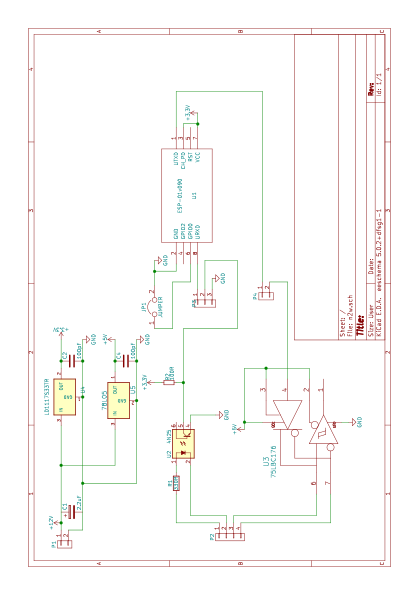

NMEA-LINK
========

This firmware connects an attached NMEA-0183 sender and an attached NMEA-0183 listener to 
 a wireless LAN using a ESP8266 Wifi module.

This is fork of [esp-link] (https://github.com/jeelabs/esp-link).

Connecting to NMEA-0183 devices
-------------------------------
The primary use of this device is to relay NMEA sentences from traditional
 devices to the wireless LAN, making them available to tablets and other devices.
Text received on the serial port input is also copied to the serial port output
 so NMEA-link can be inserted into an existing connection between two devices.
The ESP-8266 has a 3.3V UART. Connect your NMEA-0183 sending device via an opto-coupler.
 Connect your NMEA-0183 listening device via an RS-422 driver.

Connecting to NMEA-link
-----------------------
NMEA-link listens on TCP port 10111, the registered port for NMEA devices.
 It is intended to support multiple simultaneous TCP clients.
All NMEA sentences received from the serial port are send to all clients.
All text received from TCP clients is output to the serial port.
Text received from TCP clients is not output to any TCP client so this is not a general purpose NMEA multiplexer.

Hardware info
-------------
This firmware is designed for any esp8266 module. 

Here is a schematic for a module including NMEA-0183 level converters and a 12V power supply. Inputs use optical switches and its not easy to get the levels right.

Initial flashing
----------------
Follow the esp-link instructions.

Wifi configuration overview
------------------
For proper operation the end state that esp-link needs to arrive at is to have it
join your pre-existing wifi network as a pure station.
However, in order to get there NMEA-link will start out as an access point and you'll have
to join its network to configure it. The short version is:
 1. NMEA-link creates a wifi access point with an SSID of the form `ESP_012ABC` (some modules
    use a different SSID form, such as `ai-thinker-012ABC`)
 2. you join your laptop or phone to NMEA-link's network as a station and you configure
    NMEA-link wifi with your network info by pointing your browser at http://192.168.4.1/
 3. you set a hostname for NMEA-link on the "home" page, or leave the default ("nmea-link")
 4. NMEA-link starts to connect to your network while continuing to also be an access point
    ("AP+STA"), the NMEA-link may show up with a `${hostname}.local` hostname
    (depends on your DHCP/DNS config)
 4. NMEA-link succeeds in connecting and shuts down its own access point after 15 seconds,
    you reconnect your laptop/phone to your normal network and access NMEA-link via its hostname
    or IP address

Wifi configuration details
--------------------------
After you have serially flashed the module it will create a wifi access point (AP) with an
SSID of the form `ESP_012ABC` where 012ABC is a piece of the module's MAC address.
Using a laptop, phone, or tablet connect to this SSID and then open a browser pointed at
http://192.168.4.1/, you should then see the NMEA-link web site.

Now configure the wifi. The desired configuration is for the NMEA-link to be a
station on your local wifi network so you can communicate with it from all your computers.

To make this happen, navigate to the wifi page and you should see the NMEA-link scan
for available networks. You should then see a list of detected networks on the web page and you
can select yours.
Enter a password if your network is secure (highly recommended...) and hit the connect button.

You should now see that the NMEA-link has connected to your network and it should show you
its IP address. _Write it down_. You will then have to switch your laptop, phone, or tablet
back to your network and then you can connect to the NMEA-link's IP address or, depending on your
network's DHCP/DNS config you may be able to go to http://nmea-link.local

At this point the NMEA-link will have switched to STA mode and be just a station on your
wifi network. These settings are stored in flash and thereby remembered through resets and
power cycles. They are also remembered when you flash new firmware. Only flashing `blank.bin`
via the serial port as indicated above will reset the wifi settings.

There is a fail-safe, which is that after a reset or a configuration change, if the NMEA-link
cannot connect to your network it will revert back to AP+STA mode after 15 seconds and thus
both present its `ESP_012ABC`-style network and continue trying to reconnect to the requested network.
You can then connect to the NMEA-link's AP and reconfigure the station part.

One open issue (#28) is that NMEA-link cannot always display the IP address it is getting to the browser
used to configure the ssid/password info. The problem is that the initial STA+AP mode may use
channel 1 and you configure it to connect to an AP on channel 6. This requires the ESP8266's AP
to also switch to channel 6 disconnecting you in the meantime. 

Hostname, description, DHCP, mDNS
---------------------------------
You can set a hostname on the "home" page, this should be just the hostname and not a domain
name, i.e., something like "test-module-1" and not "test-module-1.mydomain.com".
This has a number of effects:
- you will see the first 12 chars of the hostname in the menu bar (top left of the page) so
  if you have multiple modules you can distinguish them visually
- NMEA-link will use the hostname in its DHCP request, which allows you to identify the module's
  MAC and IP addresses in your DHCP server (typ. your wifi router). In addition, some DHCP
  servers will inject these names into the local DNS cache so you can use URLs like
  `hostname.local`.

Troubleshooting
---------------
Follow the esp-link instructions.

Building the firmware
---------------------
Follow the esp-link instructions.

Updating the firmware over-the-air
---------------------
Follow the esp-link instructions.

Contact
-------
If you want to discuss NMEA-link, please create a github issue.
